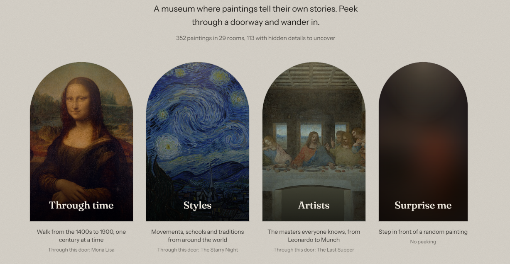
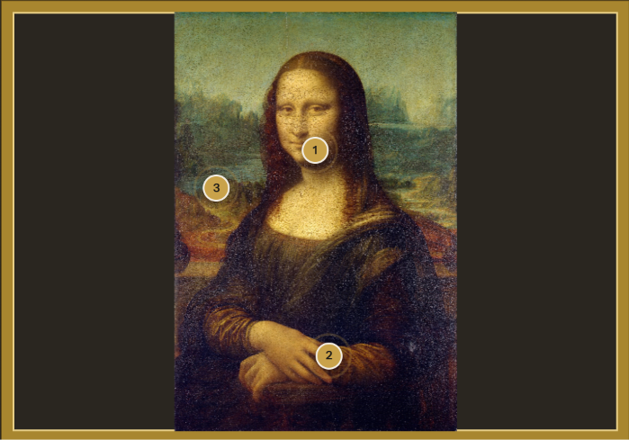

# Whispering Walls

**A free online museum where paintings tell their own stories.**

Wander through arched doorways into themed rooms, zoom right into the brushstrokes of 340+ public-domain masterpieces, tap glowing markers to uncover hidden details, and ask any painting a question. It answers in its own voice, using only what is actually recorded about it.

**Live:** https://whispering-walls-eta.vercel.app



## Features

- **Three wings, 29 rooms:** walk through time from the 1400s to 1899, explore styles from Impressionism to Mughal painting and Japanese prints, or visit rooms for 16 great artists plus a room for women artists history almost forgot
- **Deep zoom:** smooth zooming into high-resolution images with OpenSeadragon
- **Hidden details:** 240+ hand-written stories pinned to precise spots on 110+ paintings, with a "Look closer" tour that glides between them
- **Ask the painting:** an AI chat grounded in each painting's full Wikipedia article through retrieval-augmented generation (RAG), so answers stay factual and the painting admits when it doesn't know
- **Read aloud:** stories and tours narrated with the browser's built-in speech
- **Room music:** real public-domain and freely licensed classical recordings from Wikimedia Commons, matched to each room's mood
- **Postcards:** save favourite paintings as illustrated postcards with personal notes
- **Hotspot editor:** a local-only tool for placing new hidden details by clicking on a painting



## How it works

```
Wikidata (SPARQL) ──► collector script ──► paintings.json ──► React museum (Vercel)
Wikipedia articles ──► knowledge builder ──► knowledge.json ──► FastAPI backend (Render)
                                                                    │
                          visitor question ──► BM25 retrieval ──► Groq LLM ──► answer in character
```

1. **Collecting:** `scripts/collect-paintings.mjs` queries Wikidata for each room's paintings, ranked by fame, and keeps only those with a free image on Wikimedia Commons and an English Wikipedia article.
2. **Knowledge:** `backend/build_knowledge.py` downloads each painting's full Wikipedia article and hidden-detail stories, then splits them into passages.
3. **Answering:** for each question, the backend ranks passages with BM25, sends the most relevant ones to the language model with strict rules (stay in character, use only these notes, admit uncertainty), and returns the answer with its source.

## Tech stack

| Part | Tools |
|---|---|
| Frontend | React, Vite, React Router, Tailwind CSS, Motion, OpenSeadragon |
| Backend | Python, FastAPI, rank-bm25, httpx |
| AI | Groq API (gpt-oss-120b), with optional Gemini support |
| Data | Wikidata, Wikimedia Commons, Wikipedia |
| Hosting | Vercel (frontend), Render (backend) |

Everything runs on free tiers.

## Run it locally

**Requirements:** Node.js 20.19+, Python 3.11+, a free Groq API key.

```bash
# Frontend
npm install
npm run collect          # gather paintings (3 to 6 minutes)
npm run dev              # http://localhost:5173

# Backend (second terminal)
cd backend
python -m venv .venv
.venv/bin/python -m pip install -r requirements.txt     # Windows: .venv\Scripts\python
cp .env.example .env                                     # then add your GROQ_API_KEY
.venv/bin/python build_knowledge.py
.venv/bin/python -m uvicorn main:app --reload --port 8000
```

Re-collect specific rooms with `npm run collect -- artists/munch styles/landscapes`.

## Credits

- Painting images from [Wikimedia Commons](https://commons.wikimedia.org), limited to public-domain and freely licensed files
- Painting data from [Wikidata](https://www.wikidata.org)
- Stories from [Wikipedia](https://en.wikipedia.org), shared under [CC BY-SA 4.0](https://creativecommons.org/licenses/by-sa/4.0/)
- Music recordings from Wikimedia Commons, credited in the app as each piece plays
